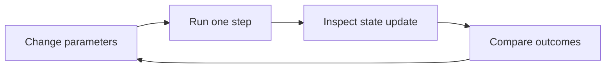
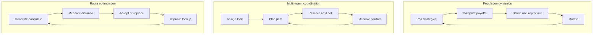
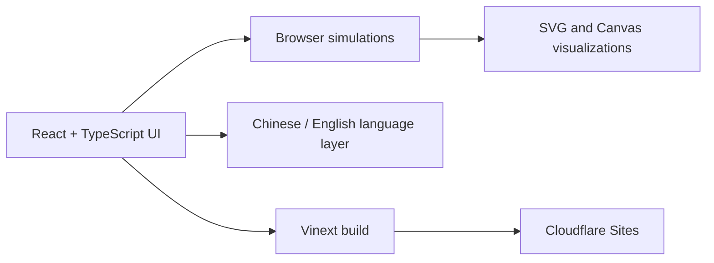

# Algorithm Visualization Laboratory

<p align="center">
  <strong>See algorithms. See thinking.</strong><br/>
  Interactive experiments for understanding how algorithms make decisions.
</p>

<p align="center">
  <a href="https://evolutionary-game-lab.aussice.chatgpt.site">Live laboratory</a> ·
  <a href="#experiments">Explore experiments</a> ·
  <a href="#run-locally">Run locally</a>
</p>

## Overview

This project turns algorithmic ideas into interactive experiments. Instead of showing only the final answer, each laboratory exposes parameters, intermediate states, decisions, and the process that produces the result.



## Experiments

| Laboratory | Main question | What is visualized |
|---|---|---|
| Evolutionary game theory | How can cooperation evolve? | Strategies, payoffs, mutation, selection, and population size |
| Multi-robot coordination | How can robots move without gridlock? | Task assignment, paths, reservations, and deadlock resolution |
| Traveling salesman problem | How does a route improve? | Candidate tours, distance changes, crossover, mutation, and local search |
| Neural network classification | How does a model learn a boundary? | Forward propagation, loss, gradients, and decision regions |
| Q-learning maze | How does an agent learn by trial and error? | Rewards, Q-values, exploration, exploitation, and policy formation |
| Boids swarm intelligence | How does order emerge from local rules? | Separation, alignment, cohesion, neighbors, and obstacle avoidance |

## Algorithm stories

Each experiment follows the same readable loop, while the computation stays faithful to the algorithm being demonstrated.



## What you can do

- Change parameters and see their effects immediately.
- Run simulations step by step instead of waiting for a black-box result.
- Inspect formulas, intermediate calculations, and decision rules.
- Compare multiple strategies on the same problem.
- Choose Chinese or English when entering the laboratory.

## Technology



The project uses React, TypeScript, Vinext, and CSS. Simulations run directly in the browser, with no backend required for the interactive demonstrations.

## Run locally

Requirements: Node.js `>=22.13.0`.

```bash
npm install
npm run dev
```

Then open the local development URL shown in the terminal.

To create a production build:

```bash
npm run build
```

## Project structure

```text
app/
├── algorithm-hub.tsx       # Main experiment index
├── evolutionary-game/      # Evolutionary game laboratory
├── robot-lab.tsx           # Multi-robot coordination
├── tsp-lab.tsx             # Traveling salesman problem
├── neural-lab.tsx          # Neural network classification
├── q-learning-lab.tsx      # Q-learning maze
└── boids-lab.tsx           # Swarm intelligence
```

## Live site

[Open Algorithm Visualization Laboratory](https://evolutionary-game-lab.aussice.chatgpt.site)

## License

This project is for learning, demonstration, and experimentation.
