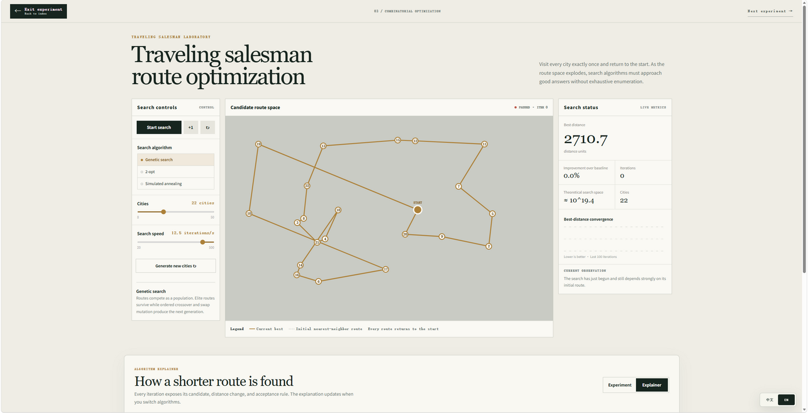
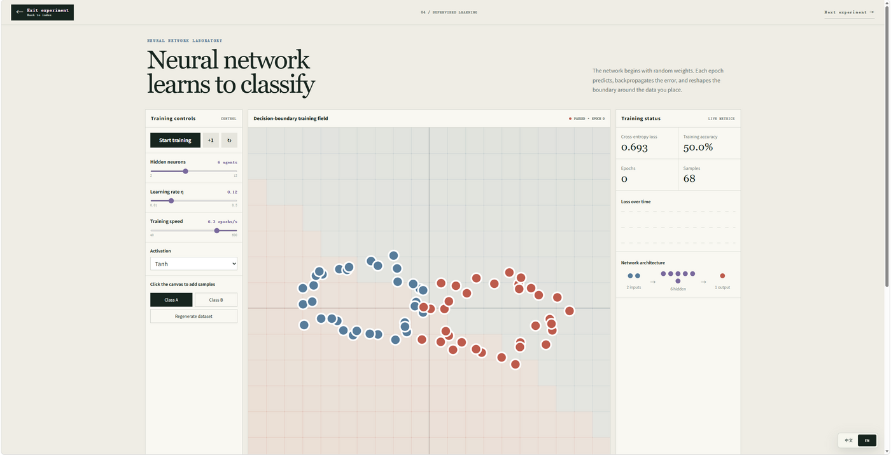

# Algorithm Visualization Laboratory

<p align="center">
  <strong>See algorithms. See thinking.</strong><br>
  Interactive experiments for understanding how algorithms make decisions.
</p>

<p align="center">
  <a href="https://evolutionary-game-lab.aussice.chatgpt.site">Open Live Laboratory</a>
</p>

## Interface Preview

### Main experiment index

The homepage brings six interactive algorithm laboratories together in one visual index.

<p align="center">
  
</p>

### Evolutionary game theory

Explore cooperation, defection, genetic strategies, selection, mutation, and population dynamics through a repeated Prisoner's Dilemma.

<p align="center">
  
</p>

### Multi-robot coordination

Observe task assignment, path planning, reservations, and deadlock resolution in a dynamic warehouse.

<p align="center">
  
</p>

### Traveling salesman problem

Compare genetic search, simulated annealing, and 2-opt local improvement as routes gradually converge.

<p align="center">
  
</p>

### Neural network classification

Follow forward propagation, loss calculation, gradient updates, and decision-boundary changes.

<p align="center">
  
</p>

### Q-learning maze

Watch an agent balance exploration and exploitation while updating its state-action values.

<p align="center">
  
</p>

### Boids swarm intelligence

See how separation, alignment, and cohesion create collective behavior from local rules.

<p align="center">
  
</p>

## Experiments

| Experiment | Main question | Visual focus |
|---|---|---|
| Evolutionary game theory | How can cooperation evolve? | Strategies, payoffs, mutation, selection, and population size |
| Multi-robot coordination | How can robots move without gridlock? | Task assignment, routes, reservations, and deadlock resolution |
| Traveling salesman problem | How does a route improve? | Candidate tours, distance changes, crossover, mutation, and local search |
| Neural network classification | How does a model learn a boundary? | Forward propagation, loss, gradients, and decision regions |
| Q-learning maze | How does an agent learn by trial and error? | Rewards, Q-values, exploration, exploitation, and policy formation |
| Boids swarm intelligence | How does order emerge from local rules? | Separation, alignment, cohesion, neighbors, and obstacle avoidance |

## Learning through experiments

Each laboratory exposes more than the final result:

- Parameters can be changed interactively.
- Simulations can be run step by step.
- Intermediate calculations are visible.
- Algorithm decisions can be inspected.
- Different strategies can be compared on the same problem.
- The interface supports both Chinese and English.

## Technology

- React
- TypeScript
- Vinext
- CSS
- SVG and Canvas visualizations
- Browser-based simulation
- Cloudflare Sites deployment

## Run locally

Requirements: Node.js `>=22.13.0`.

```bash
npm install
npm run dev
```

To create a production build:

```bash
npm run build
```

## Project structure

```text
app/
├── algorithm-hub.tsx
├── simulation-lab.tsx
├── robot-lab.tsx
├── tsp-lab.tsx
├── neural-lab.tsx
├── q-learning-lab.tsx
└── boids-lab.tsx

docs/
└── screenshots/
    ├── homepage.png
    ├── evolutionary-game.png
    ├── multi-robot.png
    ├── tsp.png
    ├── neural-network.png
    ├── q-learning.png
    └── boids.png
```

## Live site

[Algorithm Visualization Laboratory](https://evolutionary-game-lab.aussice.chatgpt.site)

## License

This project is for learning, demonstration, and experimentation.
